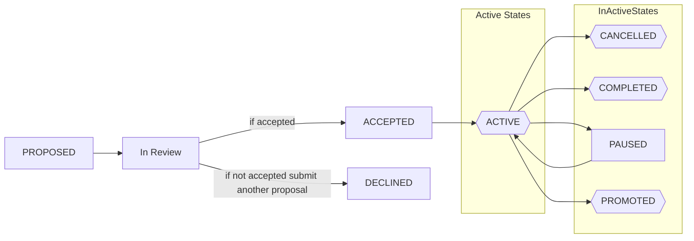

# Proposal Process

Please provide a PR in the following format: 

1. Create a branch with the following name:

`proposal/<proposal-name>`

For names, there may be no spaces, and please use snake case with lower case. i.e `<>-<>`

2. Please copy the file from `000_template.md` into `proposals/<proposal-name>/<03d>_proposal.md`.

For example, in the case of decentralized linkedin:

```sh
# clone this repo
git clone git@github.com:decentralized-identity/applications-and-implmentations-wg.git

## go into it

cd applications-and-implmentations-wg
# from the root 
mkdir proposals/decentralized-linkedin

# copy the file over
cp docs/000_template.md proposals/decentralized-linkedin/000_proposal.md

# edit it
EDITOR docs/000_template.md proposals/decentralized-linkedin/000_proposal.md # edit the file

# make a branch with it
git checkout -b proposal/decentralized-linkedin
git add . 
git commit -m "added decentralied linkedin proposal"
```

Now send a PR and request the `CODEOWNERS` to review the PR. If approved, they
will approve it, convert the status to `ACCEPTED`. 

Once it has been accepted, a repository with the following name: 

`appimp-<proposal-name>` will be created. For example, in the case of
decentralized linkedin: 

`appimp-decentralized-linkedin`

## Proposal States

### Meta States

* `PROPOSED`: This item has been proposed to the chairs of the WG, and is waiting for review. 
* `ACCEPTED`: This item has been accepted by the chairs of the WG into action.
* `PAUSED`: This working item has been accepted but not currently being worked on.
* `PROMOTED`: This working item has been promoted and has moved on to either a WG or another SDO.
* `CANCELLED`: This working item has been cancelled. A cancelled item may not be re-activated. 
* `ACTIVE`: This working item has been accepted and is currently being worked on.
* `COMPLETED`: This working item has been completed and is done and has not been promoted.


