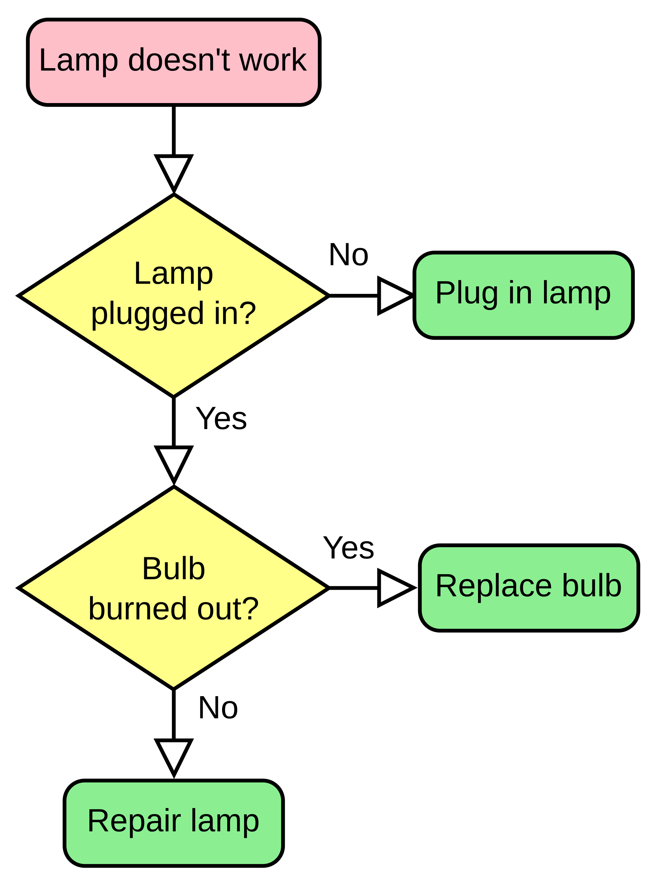

# Initial Proposal

## Metadata
- Proposal Author(s): [Kim Duffy](kimdhamilton)
- Chair(s): [Kim Duffy](kimdhamilton)
- Status: [Proposed]()
- Since: March 18, 2025
- Tags: sample, intro
- Supersedes:
- Version: 0.0.1
- Start Date: <date> //leave blank
- URI: <uri> //leave blank

## Summary

One paragraph max and one diagram max, please.

Src: [I made it up](https://i.kym-cdn.com/photos/images/newsfeed/002/360/522/db7.jpg)

## Motivation

Why this project, why now, why DIF Labs, what kind of feedback/mentoring sought

## Problem

## Approach

## Team

## Outputs

Can be hard deliverables or softer goals

## Coordination Format

By default:

- Bi-weekly updates on progress and blockers
- Monthly community calls for feedback and discussion
- GitHub discussions for technical proposals
- Regular documentation updates

## Prior art

Links and one-sentence summary of relevance for prior art (can be code or specs or products)

## Unresolved Questions

About DIF, the process, or the commitment if accepted.

