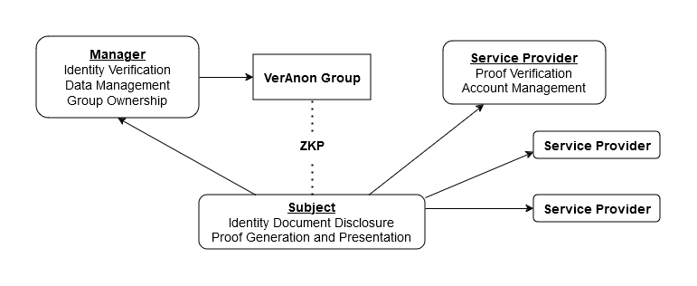

# VerAnon Proposal

## Metadata
- Proposal Author(s): [Alex Hache](https://github.com/ahache)
- Chair(s): Alex Hache
- Status: [Proposed]()
- Since: November 20, 2024
- Expected End Date: January 31, 2025
- Version: 0.0.1

[//]: # (Do not fill out below. To be filled out by chairs post-approval)
- Start Date: <date>
- URI: <uri>

## Summary 

VerAnon is a protocol for anonymous personhood verification using Semaphore, a zero-knowledge group membership protocol.
- The protocol involves three key participants:
  - Subjects: Individuals seeking to privately associate verified personhood with participating services
  - Managers: Trusted entities that verify identities and maintain Semaphore groups
  - Service Providers: Applications/services that require verified unique personhood
- Subjects provide identity documents to Managers for verification 
- Once verified, the Subject's Semaphore Identity Commitment is added to the Manager's Semaphore group
- Managers handle identity verification, group administration, and registration records
- Subjects can prove their group membership (personhood) to Service Providers anonymously and uniquely using zero-knowledge proofs generated by Semaphore circuits
- Service Providers can select which Managers they trust for user personhood verification

## Motivation

VerAnon represents one potential approach to addressing the goals outlined in the Personhood Credential Initiative (PHC). The primary motivation is to enhance trust in online spaces by:

- Preventing bot accounts from being created at scale by enforcing unique use of personhood proofs within a service
- Providing a more organic web experience for users
- Protecting user privacy through ZKPs (anonymous verification and unlinkable use of proofs across different services)

This protocol aims to demonstrate how zero-knowledge technology can meet these goals while maintaining a somewhat familiar trust model.

## Technical Goals

The primary goals are to implement the core protocol and supporting client applications. In addition, a pilot Manager and Service Provider would be useful to demonstrate the protocol.

### Core Protocol
- Semaphore smart contracts
- Group administration interface for Managers
- Proof verification and account association tools for Service Providers
- Protocol specifications and documentation

### Client Applications
- Subject Mobile App
   - Semaphore identity generation and management, recovery mechanisms
   - Zero-knowledge proof generation
   - Secure identity document submission (this may involve using third party tools and potentially being stubbed initially)

- Manager Web Interface
   - Protocol registration
   - Group management dashboard for adding and updating Identity Commitments

- Service Provider Web Interface
   - Protocol registration and configuring trusted Managers
   - Relay configuration and funding for metatransaction support (this may be just out of scope initially)

### Pilot Implementation

A further goal is to include a pilot implementation of the protocol, setting up a basic Manager and Service Provider. Ultimately, this would aim to allow someone to use the complete protocol flow, verifying their identity and associating a personhood proof with a service account.

- Manager
    - Identity verification (potentially using a third party utility)
    - Registration data storage
- Service Provider
    - Some service that allows for basic account interaction (e.g. a forum)
    - Account creation and personhood proof association

## Coordination/Correspondence

## Prior art

## Unresolved Questions

## Outputs

